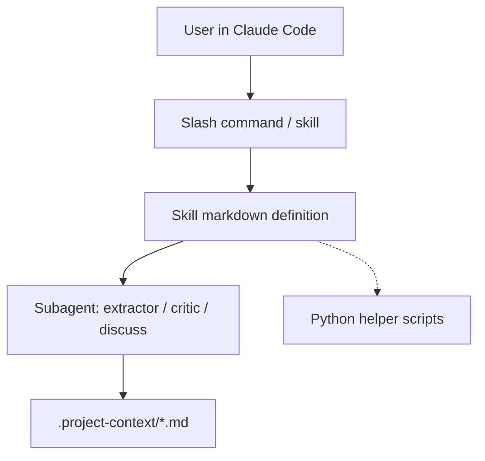

# Architecture

## Diagram

## Components

- **project-context** — main plugin; richer context model (architecture, patterns, plans, progress, brief, state)
- **project-context-mini** — sibling plugin; lean four-file model (architecture, flows, patterns, status)
- **skills/** — markdown skill definitions (update, discuss, etc.)
- **agents/** — subagent definitions (content-extractor, update-critic, …)
- **scripts/** — Python helpers (manage_context.py, fetch_git_deps.py) — main plugin only

## Tech Stack

- Language: Markdown (primary), Python (helper scripts)
- Framework: Claude Code plugin spec (`.claude-plugin/plugin.json`)
- Storage: `.project-context/*.md` files in target user repo
- Deploy: Marketplace entry in `.claude-plugin/marketplace.json`

## Dependencies

- Claude Code runtime (skills, subagents, slash commands)
- `git` (sparse-checkout in fetch_git_deps.py)
