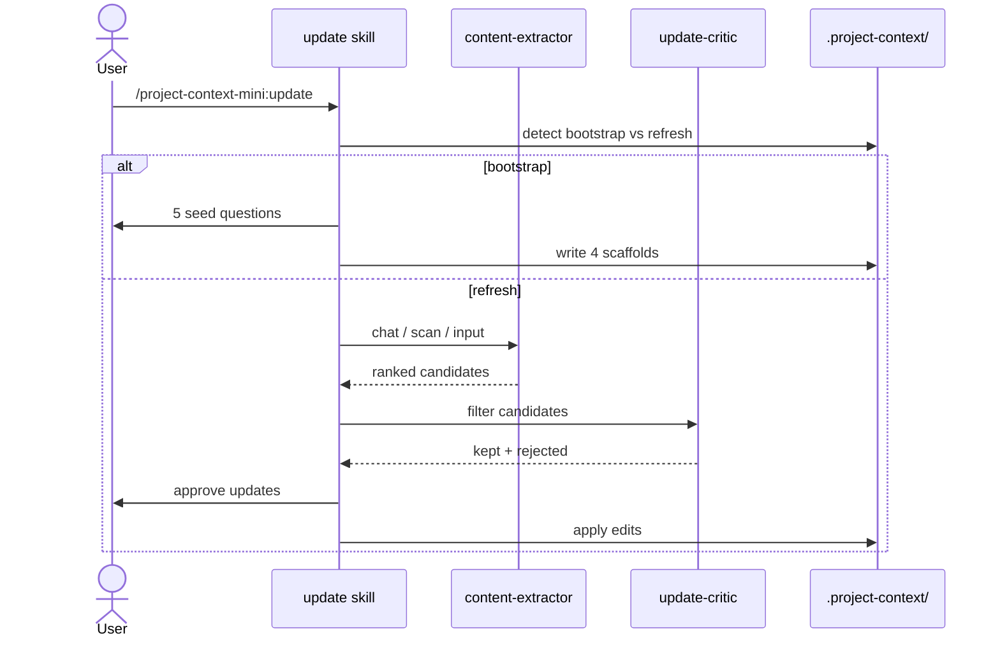
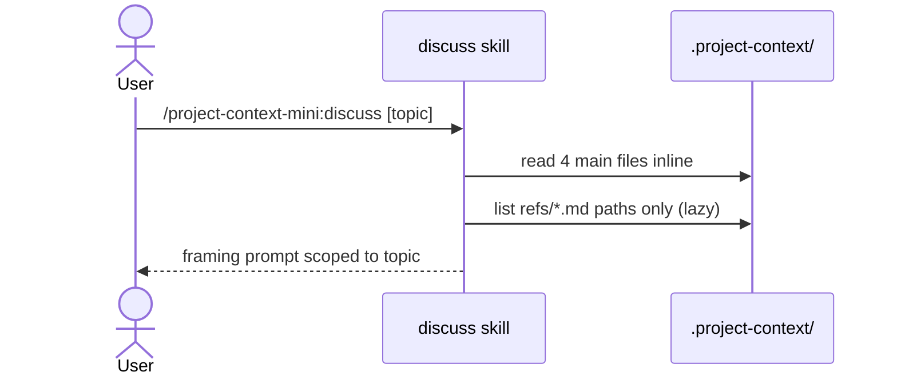

# User Flows

## Update — bootstrap or refresh context

Bootstrap creates the four files from seeded scaffolds. Refresh runs the two-agent extractor+critic pipeline to ruthlessly filter new knowledge before writing.

## Discuss — prime agent for project conversation

Lazy-loads `refs/*.md` — the agent reads a specific ref on demand to prevent context bloat as refs accumulate.
