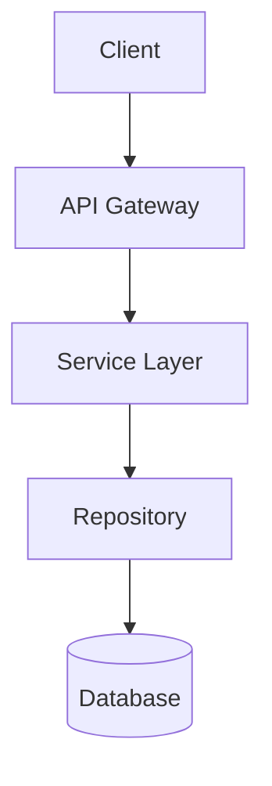
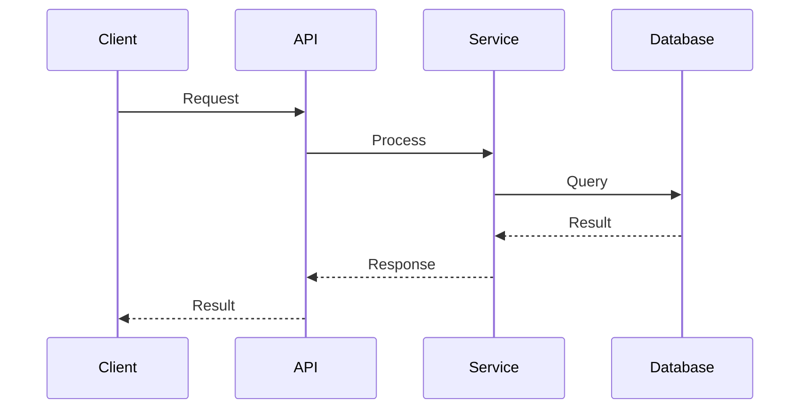

# Planning Templates

Use these as starting points. Remove irrelevant sections, add domain-specific ones.

## Feature Plan Template

```markdown
# [Feature Name] Plan

**Status:** Planning | In Progress | Completed
**Created:** YYYY-MM-DD
**Last Updated:** YYYY-MM-DD

## Overview
**Problem:** [What problem does this solve?]
**Solution:** [High-level approach]
**Success Metrics:** [How we'll measure success]

## Requirements

### Functional
1. **[Requirement]** — [User story or description]
   - [ ] Acceptance criterion 1
   - [ ] Acceptance criterion 2

### Non-functional
- **Performance:** [Expectations]
- **Security:** [Requirements]
- **Scalability:** [Needs]

### Out of Scope
- [Explicitly deferred items]

## Decisions

Locked decisions from brainstorming (from /project-context:brainstorm):

| Decision | Choice | Rationale |
|----------|--------|-----------|
| [What] | [Chosen option] | [Why] |

## Technical Design

### Architecture
[Mermaid diagram or description]

### Key Components
1. **[Component]**
   - Purpose: [What it does]
   - Files: [Exact paths]
   - Dependencies: [What it needs]

## Implementation Phases

### Phase 1: [Name] (MVP)
**Goal:** [What this achieves]

#### Task 1: [Name]
- **Files:** [exact paths]
- **Action:** [Concrete implementation steps]
- **Verify:** [Command or check to confirm it works]
- **Done when:** [Observable acceptance criteria]

#### Task 2: [Name]
[Same structure]

### Phase 2: [Name]
[Same structure]

## Risks & Mitigation

| Risk | Likelihood | Impact | Mitigation |
|------|------------|--------|------------|
| [Description] | High/Med/Low | High/Med/Low | [Strategy] |

## Dependencies
- [External/internal dependencies]

## Next Steps
1. [Immediate action]
2. [Following action]
```

## Quick Plan Template

For smaller features or spikes:

```markdown
# [Feature] Quick Plan

**Goal:** [One sentence]

## What & Why
- **What:** [Brief description]
- **Why:** [Problem it solves]

## Tasks
1. **[Task name]**
   - Files: [paths]
   - Action: [what to do]
   - Verify: [how to check]
   - Done: [acceptance criteria]

2. **[Task name]**
   [Same structure]

## Risks
- [Risk]: [Mitigation]
```

## ERD (Engineering Requirements Document) Template

For detailed technical design documents created after PRD review. ERDs focus on *how* to build what the PRD defines. Each PRD milestone typically gets its own ERD.

```markdown
# [Feature/Milestone] ERD

**Status:** Draft | Review | Approved | Implementing
**PRD Reference:** [Link or name of source PRD]
**Milestone:** [M1/M2/M3 — which PRD milestone this covers]
**Created:** YYYY-MM-DD
**Last Updated:** YYYY-MM-DD

## Context

**PRD Goal:** [What the PRD asks for in this milestone]
**Technical Goal:** [How we'll achieve it — one sentence]

## Locked Decisions

From `/project-context:brainstorm` PRD review:

| Decision | Choice | Alternatives Considered | Rationale |
|----------|--------|------------------------|-----------|
| [What] | [Chosen] | [What was rejected] | [Why] |

## Data Models

### Entity Relationship

```mermaid
erDiagram
    [Entity1] ||--o{ [Entity2] : "relationship"
    [Entity1] {
        uuid id PK
        string name
        timestamp created_at
    }
```

### Schema Details

**[Entity1]**
| Field | Type | Constraints | Notes |
|-------|------|-------------|-------|
| id | UUID | PK, auto-gen | |
| [field] | [type] | [constraints] | [notes] |

### Migrations
- [Migration description and ordering]

## API Contracts

### [Endpoint Group]

**`POST /api/[resource]`**
- **Auth:** [Required/Public]
- **Request:**
  ```json
  { "field": "type — description" }
  ```
- **Response (200):**
  ```json
  { "field": "type — description" }
  ```
- **Errors:** 400 (validation), 401 (unauthorized), 409 (conflict)

## Architecture

### Component Diagram



### Component Details

1. **[Component]**
   - Purpose: [What it does]
   - Files: [Exact paths — new or modified]
   - Interface: [Public API / methods]
   - Dependencies: [What it needs]

### Sequence Diagrams



## Security Considerations
- **Authentication:** [How requests are authenticated]
- **Authorization:** [Permission model]
- **Data Protection:** [Encryption, PII handling]
- **Input Validation:** [Validation strategy]

## Performance Considerations
- **Expected Load:** [Requests/sec, data volume]
- **Bottlenecks:** [Known hot paths]
- **Caching Strategy:** [What, where, TTL]
- **Database Indexes:** [Required indexes]

## Implementation Phases

### Phase 1: [Name]
**Goal:** [What this achieves]

#### Task 1: [Name]
- **Files:** [exact paths]
- **Action:** [Concrete implementation steps]
- **Verify:** [Command or check to confirm it works]
- **Done when:** [Observable acceptance criteria]

## Testing Strategy
- **Unit Tests:** [What to test, coverage target]
- **Integration Tests:** [API contract tests, DB tests]
- **E2E Tests:** [Critical user flows]

## Risks & Mitigation

| Risk | Likelihood | Impact | Mitigation |
|------|------------|--------|------------|
| [Description] | High/Med/Low | High/Med/Low | [Strategy] |

## Open Questions
- [ ] [Unresolved question — owner — deadline]
```

## PRD Summary Template

For capturing PRD information in `brief.md` when a PRD is the starting point. Use during `/project-context:init` or `/project-context:update`.

```markdown
## PRD Summary

**PRD:** [Name/link to original PRD]
**Product Owner:** [Who owns the PRD]
**Timeline:** [Overall timeline]

### Milestones

| Milestone | Scope | Target Date | ERD Status |
|-----------|-------|-------------|------------|
| M1: [Name] | [Brief scope] | [Date] | Draft/Approved/Done |
| M2: [Name] | [Brief scope] | [Date] | Not Started |
| M3: [Name] | [Brief scope] | [Date] | Not Started |

### Success Metrics
- [Metric from PRD]

### Stakeholders
- [Role]: [Name/team]
```

## Choosing Templates

- **Feature Plan**: Single feature (1-4 weeks scope)
- **Quick Plan**: Small feature, spike, POC (<1 week)
- **ERD**: Technical design for a PRD milestone — use when you need data models, API contracts, and sequence diagrams
- **PRD Summary**: Capture PRD info in brief.md as the starting point for ERD planning
- For larger projects, use Feature Plan template but add a Roadmap section with multiple phases

## Template Principles

- Fill only relevant sections — don't pad empty ones
- Tasks must be executable: files, action, verify, done
- Keep plans as prompts, not documentation
- Update plans as you learn — they're living documents
