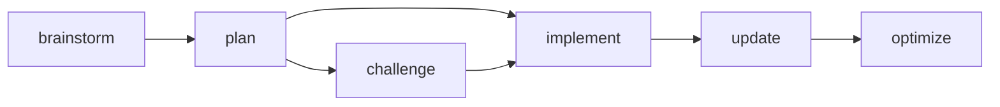

# Feature Development Workflow

Quick reference for the end-to-end flow of adding a new feature using project-context skills.

## Flow

```
brainstorm → plan → challenge (optional) → implement → update
```



## Steps

### 1. Brainstorm (`/project-context:brainstorm`)

**When:** You have a feature idea but need to resolve ambiguity before planning.

**What it does:**
- Reads project context (brief, architecture, dependencies)
- Identifies 3-5 gray areas specific to the feature type
- Deep-dives each gray area with focused questions (2-4 per area)
- Produces **locked decisions** that constrain the planner

**Output:** Decisions Summary with locked choices, rationale, and constraints.

**Skip if:** Requirements are already crystal clear and no ambiguity exists.

### 2. Plan (`/project-context:plan`)

**When:** Requirements are clear (from brainstorm or already known).

**What it does:**
- Checks for locked decisions from brainstorm
- Gathers any missing requirements (max 4-5 questions per round)
- Creates phased plan with executable tasks (Files, Action, Verify, Done)
- Saves plan to `.project-context/plans/<feature-name>.md`
- Creates per-feature progress file at `.project-context/progress/<feature-name>.md`
- Updates `state.md` and `progress.md` index

**Output:** Saved plan file + per-feature progress file + context sync.

### 3. Challenge (`/project-context:challenge`) — Optional

**When:** The plan touches risky areas (security, performance, data integrity) or you want a second opinion.

**What it does:**
- Stress-tests the plan through domain-specific critics (API, security, UX, performance, etc.)
- Identifies blind spots, edge cases, and risks
- Proposes mitigations

**Output:** Challenge report with issues ranked by severity.

### 4. Implement (`/project-context:implement`)

**When:** Plan is approved and ready for execution.

**What it does:**
- Executes plan phase-by-phase with parallel agents for independent tasks
- Follows deviation rules (auto-fix bugs, ASK for architecture changes)
- Updates per-feature progress file after each phase
- Syncs all context files on completion (state, progress, architecture, patterns)

**Output:** Working code + updated context files.

### 5. Update (`/project-context:update`)

**When:** After implementation to capture learnings, or after any significant work session.

**What it does:**
- Analyzes conversation/code changes for insights
- Categorizes learnings to appropriate context files
- Proposes updates for user approval
- Suggests optimization if files have grown large

**Output:** Updated context files with captured learnings.

### 6. Optimize (`/project-context:optimize`) — As Needed

**When:** Context files grow large, or after completing multiple features.

**What it does:**
- **Compact:** Summarize verbose sections, condense completed per-feature files
- **Organize:** Normalize structure, deduplicate, split large files

## Parallel Feature Development

Multiple features can be developed in parallel because each feature gets its own:
- **Plan file:** `.project-context/plans/<feature-name>.md`
- **Progress file:** `.project-context/progress/<feature-name>.md`

The main `progress.md` stays a lightweight index:

```markdown
## Active Features
- **Auth System** — In Progress → [progress/auth-system.md](progress/auth-system.md)
- **Dashboard** — Planning → [progress/dashboard.md](progress/dashboard.md)

## Completed Features
- [CLI Tool](progress/cli-tool.md) (2026-03-15)
```

This prevents `progress.md` from growing unbounded and keeps each feature's history self-contained.

## Quick Commands

| Need | Command |
|------|---------|
| Start from scratch | `/project-context:brainstorm` |
| Requirements already clear | `/project-context:plan` |
| Stress-test a plan | `/project-context:challenge` |
| Execute a plan | `/project-context:implement` |
| Capture learnings | `/project-context:update` |
| Clean up files | `/project-context:optimize` |
| See what's next | `/project-context:next` |
| Quick small task | `/project-context:quick` |
