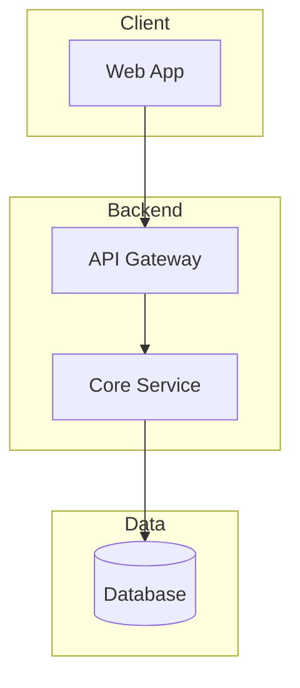

# Context File Templates

Templates for each project context file. Use with `/project-context:init`.

## brief.md

```markdown
# Project Brief

## Overview
[1-2 paragraph description of what the project is and why it exists]

**Project Name:** [Name]
**Type:** [Web App / Mobile App / CLI Tool / Library / API]
**Target Users:** [Who uses this]

## Goals
1. [Primary goal]
2. [Secondary goal]

## Scope

### In Scope
- [Feature/capability]

### Out of Scope
- [Explicitly not doing]

### Constraints
- Timeline: [if applicable]
- Technical: [limitations]

---
*Last updated: YYYY-MM-DD*
```

## architecture.md

```markdown
# Architecture

## Tech Stack

| Layer | Technology | Purpose |
|-------|------------|---------|
| Frontend | [e.g., React] | [UI rendering] |
| Backend | [e.g., Node.js] | [API/business logic] |
| Database | [e.g., PostgreSQL] | [Data persistence] |
| Infrastructure | [e.g., AWS] | [Hosting/deployment] |

## System Overview



**Flow:** Client → API Gateway → Service → Database

## Key Decisions

| Decision | Choice | Rationale | Date |
|----------|--------|-----------|------|
| | | | |

---
*Last updated: YYYY-MM-DD*
```

## state.md

```markdown
# State

## Current Position
**Phase:** [Planning / Development / Testing / Production]
**Active Plan:** [plan name or "none"]
**Focus:** [1 sentence: what's being worked on right now]

## Session Info
**Last Session:** YYYY-MM-DD
**Context:** [Brief note about what was happening]

## Blockers
- [None or list active blockers]

## Decisions Pending
- [None or list pending decisions]

## Next Action
[What to do next — used by /project-context:next for routing]

---
*Last updated: YYYY-MM-DD*
```

## progress.md

```markdown
# Progress

## Completed
- [x] [Feature/task] (YYYY-MM-DD)

## In Progress
- [ ] **[Feature]** — [status/percentage]

## Upcoming
- [ ] [Feature]

## Known Issues
| Issue | Severity | Workaround |
|-------|----------|------------|
| | | |

---
*Last updated: YYYY-MM-DD*
```

## patterns.md

```markdown
# Patterns & Learnings

## Code Patterns

### [Pattern Name]
**When:** [Situation]
**Example:**
```[language]
// code example
```
**Notes:** [Caveats]

## Naming Conventions

| Type | Convention | Example |
|------|------------|---------|
| Files | kebab-case | `user-service.ts` |
| Classes | PascalCase | `UserService` |
| Functions | camelCase | `getUserById` |

## Learnings
- [What worked and why]
- [What didn't work and what to do instead]

## Anti-Patterns
- **[Name]**: [Problem] → [Do this instead]

---
*Last updated: YYYY-MM-DD*
```

## dependencies.json

For projects that need to declare relationships with other projects.
This file is optional — only needed when a project has cross-project dependencies.
Supports two dependency types: **local path** (monorepo siblings) and **git link** (remote repositories).

```json
{
  "upstream": [
    {
      "project": "shared",
      "path": "../shared",
      "description": "Shared library providing domain types, validation logic, and common utilities",
      "what": "Types, validation utilities",
      "note": "Core domain types"
    },
    {
      "project": "auth-service",
      "git": "https://github.com/org/auth-service.git",
      "ref": "main",
      "description": "Authentication microservice handling OAuth2 and JWT token lifecycle",
      "what": "Auth API types, JWT schemas",
      "note": "External auth service"
    }
  ],
  "downstream": [
    {
      "project": "web",
      "path": "../web",
      "what": "REST API endpoints",
      "note": "v2 API"
    }
  ]
}
```

**Fields per entry (local path dependency):**

| Field | Required | Description |
|-------|----------|-------------|
| `project` | Yes | Name of the dependency |
| `path` | Yes | Relative path from this project (e.g., `../shared`) |
| `description` | No | One-line summary of what this project IS — auto-computed from its `brief.md`. Saves context by eliminating the need to load dep files for basic orientation. |
| `what` | Yes | What is shared at the boundary (types, API, utilities, etc.) |
| `note` | No | Additional context (can be empty string) |

**Fields per entry (git link dependency):**

| Field | Required | Description |
|-------|----------|-------------|
| `project` | Yes | Name of the dependency |
| `git` | Yes | Git repository URL (HTTPS or SSH) |
| `ref` | No | Branch, tag, or commit to track (default: `main`) |
| `description` | No | One-line summary of what this project IS — auto-computed from its cached `brief.md`. Saves context by eliminating the need to load dep files for basic orientation. |
| `what` | Yes | What is shared at the boundary (types, API, utilities, etc.) |
| `note` | No | Additional context (can be empty string) |

A dependency entry uses either `path` (local) or `git` (remote), never both.
Git link dependencies are fetched into `.project-context/.deps-cache/<project>/` via `/project-context:add-dependency --fetch`.
